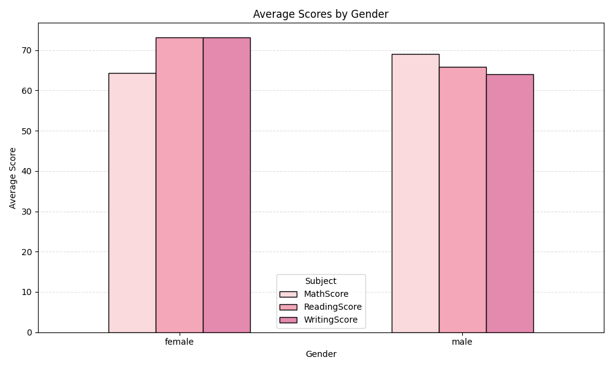
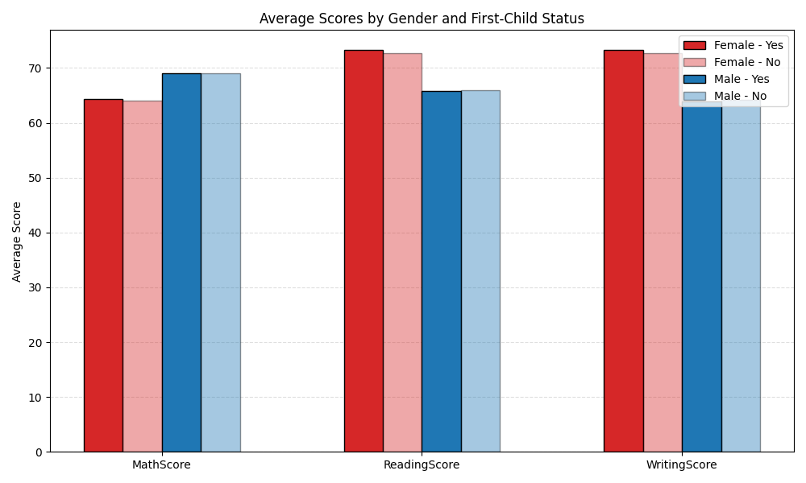
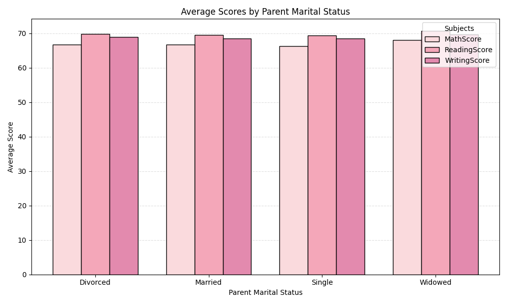
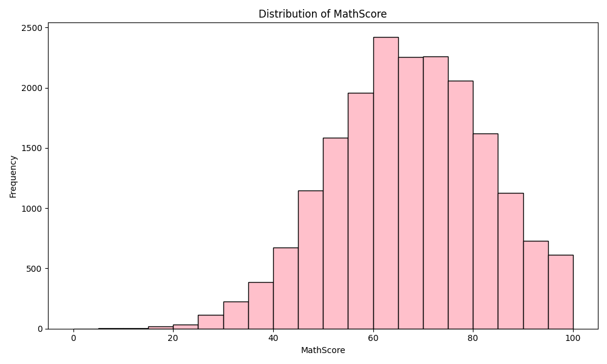
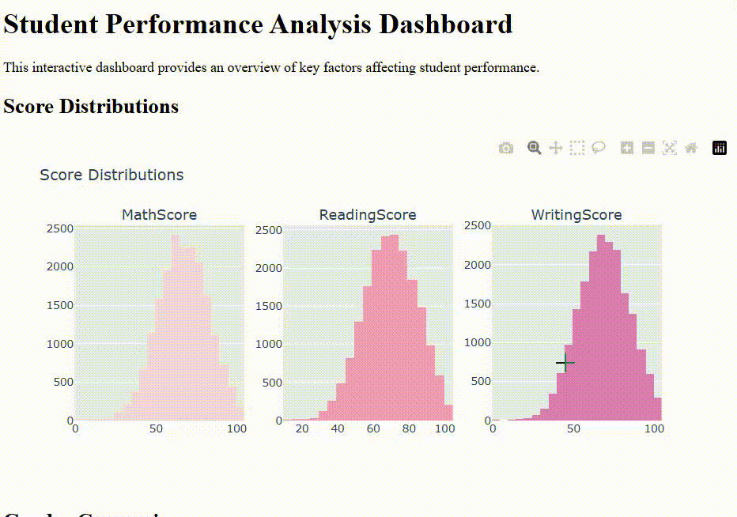

# Student Score Analysis Dashboard

This project focuses on analyzing student performance using [**Kaggle Students Exam Scores Dataset**](https://www.kaggle.com/datasets/desalegngeb/students-exam-scores).  
The goal is to explore key factors affecting scores and provide both static and interactive visualizations. This project 
was started as part of the NumPy series, but in addition to NumPy, many other libraries were extensively used, so it would not 
be accurate to describe it as purely NumPy-based at this point.

---

## 📌 Project Overview

Analyzing student performance is important to understand the effects of demographic, familial, and behavioral factors on academic success.  
This project provides insights into:

- Gender differences in scores
- First-child status impact
- Study hours correlation
- Parent marital status influence
- Overall score distributions

The project provides:  
- Static PNG plots for key analyses  
- Interactive dashboard for exploring aggregated data  

---

## 📊 Dataset

The dataset consists of exam scores and related attributes of students.

- Source: [**Kaggle Students Exam Scores Dataset**](https://www.kaggle.com/datasets/desalegngeb/students-exam-scores)  
- features:  
  - Demographic: Gender, First-child status, Number of siblings  
  - Family: Parent marital status, Parent education  
  - Behavior: Weekly study hours, Practice sport  
  - Scores: MathScore, ReadingScore, WritingScore

The raw CSV data is stored under `data/raw` and preprocessed into `data/processed`.

---

### Example Outputs

- Average Scores by Gender  
  


- Average Scores by First-Child Status & Gender  
  


- Parent Marital Status vs Scores  
  


- Score Distributions  



- Interactive Dashboard Preview  



#### Interactive Dashboard (LIVE)
🖱️: <a href="https://busracevik.github.io/numpy-students-score-analysis/index.html" target="_blank">View Interactive Dashboard</a>

---

## 📁 Project Structure

```text
numpy-student-score-analysis/
│
├── data/
│ ├── raw/ # Original Kaggle CSV dataset
│ └── processed/ # Cleaned CSV
│
├── outputs/
│ ├── gender_analysis/ # PNG plots by gender
│ ├── first_child_analysis/ # PNG plots by first-child status
│ ├── parent_marital_status/ # PNG plots by parent marital status
│ └── score_statistics/ # Score distributions and statistics
│
├── src/
│ ├── data_preparation.py
│ ├── first_child_analysis.py
│ ├── gender_analysis.py
│ ├── score_relationships.py
│ ├── score_statistics.py
│ └── visualisation.py
│
├── docs/
│ ├── index.html # Interactive dashboard
│ └── demo.gif
│
├── main.py
└── README.md
```

---

## 🛠 Technologies Used

- **Python** – Core programming language  
- **Pandas** – Data preprocessing and analysis  
- **NumPy** – Numerical computations  
- **Matplotlib** – Static visualization (PNG output)  
- **Plotly** – Interactive visualizations for dashboard  
- **GitHub Pages** – Hosting interactive HTML dashboard  

## 🧠 Analyses Implemented

### Score Distributions
Distribution of Math, Reading, and Writing scores across all students.

### Gender Analysis
Average scores by gender.

### First-Child & Gender Analysis
Comparison of average scores for first-child vs non-first-child students across genders.

### Parent Marital Status Analysis
Impact of family structure on student performance.
